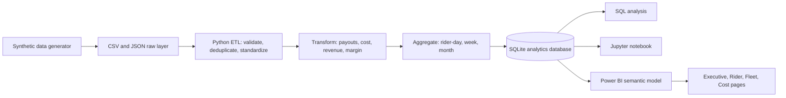
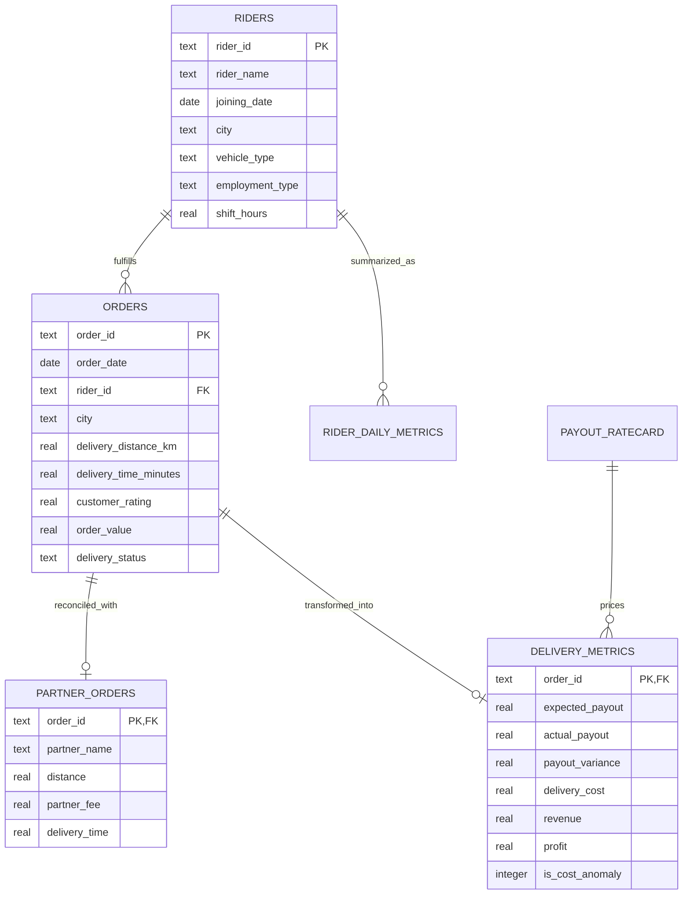

## Delivery Operations Analytics Dashboard

A portfolio-ready delivery analytics project modeled on last-mile operations at
food delivery, quick-commerce, and e-commerce logistics companies. It combines
synthetic operational data, a reproducible ETL pipeline, SQLite analytics,
Python exploration, payout reconciliation, anomaly detection, and a four-page
Power BI design.

## Business Problem

Delivery operations teams need to balance service volume, rider capacity, and
unit economics. This project answers:

- What is the cost per completed delivery, and how does it change by city,
  month, rider, and employment model?
- Which riders are productive and well utilized?
- How do first-party (1P) and third-party (3P) fleets compare?
- Are invoices and rider payouts consistent with the approved rate card?
- Which deliveries have unusually high costs and require investigation?

## Project Results

The deterministic sample run produces:

| Metric | Result |
|---|---:|
| Riders | 600 |
| Valid orders | 59,990 |
| Delivered orders | 56,912 |
| Partner deliveries | 11,998 |
| Average CPD | INR 57.16 |
| Cost anomalies | 2,433 |
| Data period | 2024-01-01 to 2025-12-31 |

## Dataset Description

| Source | Grain | Rows generated | Purpose |
|---|---|---:|---|
| `riders.csv` | One rider | 600 | Rider profile and planned shift |
| `orders.csv` | One order | 60,075 raw | Delivery activity and outcomes |
| `payout_ratecard.csv` | One vehicle type | 3 | Contract payout rules |
| `third_party_feed.json` | One partner delivery | 12,000 raw | 3P invoice reconciliation |

The raw order file deliberately includes 75 duplicate rows and 10 invalid dates.
The ETL audit removes these records and reports two partner rows that no longer
match after cleaning.

## Architecture



## Entity Relationship Diagram



## ETL Workflow

1. Read rider, order, and rate-card CSV files.
2. Parse the nested logistics partner JSON feed.
3. Validate dates, numeric ranges, business enums, foreign keys, and identifiers.
4. Remove duplicate orders and reject malformed records.
5. Calculate expected payout from vehicle rate cards.
6. Reconcile expected and actual payout; use partner fees for matched 3P orders.
7. Calculate delivery cost, allocated revenue, profit, and margin.
8. Flag cost anomalies above population mean plus two standard deviations.
9. Aggregate rider-day productivity/utilization and weekly/monthly KPIs.
10. Load all source and analytical tables into SQLite in one transaction.

## KPI Definitions

| KPI | Formula |
|---|---|
| Cost Per Delivery | Total delivery cost / delivered orders |
| Rider Productivity | Delivered orders / planned shift hours |
| Utilization Rate | Active delivery hours / planned shift hours |
| Expected Payout | Base payout + distance rate + per-order payout |
| Payout Variance | Actual payout - expected payout |
| Revenue | Allocated platform commission plus service fee |
| Profit | Revenue - delivery cost |
| Profit Margin | Profit / revenue |
| Cost Anomaly | Delivery cost > mean + 2 population standard deviations |

See [docs/kpi_documentation.md](docs/kpi_documentation.md) for business rules and
[docs/data_dictionary.md](docs/data_dictionary.md) for field-level definitions.


## SQL Analysis

The query pack includes:

- CPD by city, month, and rider
- Top and bottom riders by normalized productivity
- 1P versus 3P cost, distance, productivity, and utilization
- Rate-card reconciliation and largest invoice variances
- Statistical cost anomaly detection in pure SQLite SQL
- Weekly and monthly trend extracts

Run queries from [sql/analytics_queries.sql](sql/analytics_queries.sql).

## Dashboard

### Ready-to-Show Interactive Dashboard

Open [powerbi/delivery_operations_dashboard.html](powerbi/delivery_operations_dashboard.html)
in Edge or Chrome. It is a standalone, offline dashboard with four navigable
pages, working year/city/fleet filters, KPI cards, charts, tooltips, rider
rankings, 1P/3P comparisons, and an anomaly audit table. No server, database
connection, Python environment, or internet access is required to present it.

The Power BI specification is in
[powerbi/dashboard_design.md](powerbi/dashboard_design.md), including model
relationships, DAX measures, layout, filters, and interaction behavior.

Generated dashboard mockups:


## Key Insights

- Bengaluru drives the most volume with 15,973 delivered orders.
- Overall CPD is INR 57.16; city CPD stays within a narrow operational band,
  while Pune is lowest at INR 54.79.
- 1P CPD is INR 57.80 versus INR 55.89 for 3P in this scenario.
- 2,433 deliveries exceed the statistical cost threshold of INR 92.78.
- Monthly volume grows from 2,301 deliveries in January 2024 to 2,597 in
  December 2025, with predictable seasonal variation.

## Run Locally

From the project root:

```powershell
python scripts/generate_data.py
python etl/etl_pipeline.py
python scripts/generate_dashboard_mockups.py
python scripts/generate_interactive_dashboard.py
```

The three commands above require only Python 3.10+.

For the notebook:

```powershell
python -m venv .venv
.\.venv\Scripts\Activate.ps1
pip install -r requirements.txt
jupyter lab notebooks/delivery_operations_analysis.ipynb
```

To inspect the database:

```powershell
python -c "import sqlite3; c=sqlite3.connect('delivery_operations.db'); print(c.execute('SELECT COUNT(*) FROM delivery_metrics').fetchone())"
```

## Repository Structure

```text
delivery-operations-dashboard/
|-- data/
|   |-- riders.csv
|   |-- orders.csv
|   |-- payout_ratecard.csv
|   `-- third_party_feed.json
|-- docs/
|   |-- data_dictionary.md
|   `-- kpi_documentation.md
|-- etl/
|   `-- etl_pipeline.py
|-- notebooks/
|   `-- delivery_operations_analysis.ipynb
|-- powerbi/
|   |-- mockups/
|   `-- dashboard_design.md
|-- scripts/
|   |-- generate_data.py
|   `-- generate_dashboard_mockups.py
|-- sql/
|   |-- schema.sql
|   `-- analytics_queries.sql
|-- delivery_operations.db
|-- requirements.txt
`-- README.md
```

## Resume Bullet Points

- Built an end-to-end delivery operations analytics solution over 60K orders
  and 600 riders using Python, SQL, SQLite, and Power BI design patterns.
- Engineered a reproducible ETL pipeline with data-quality controls, payout
  reconciliation, rider productivity, utilization, CPD, and profit metrics.
- Developed weekly and monthly KPI marts plus statistical anomaly detection to
  identify 2.4K high-cost deliveries for operational review.
- Designed a four-page executive dashboard comparing city, rider, and 1P/3P
  performance with drill-through and reconciliation workflows.
